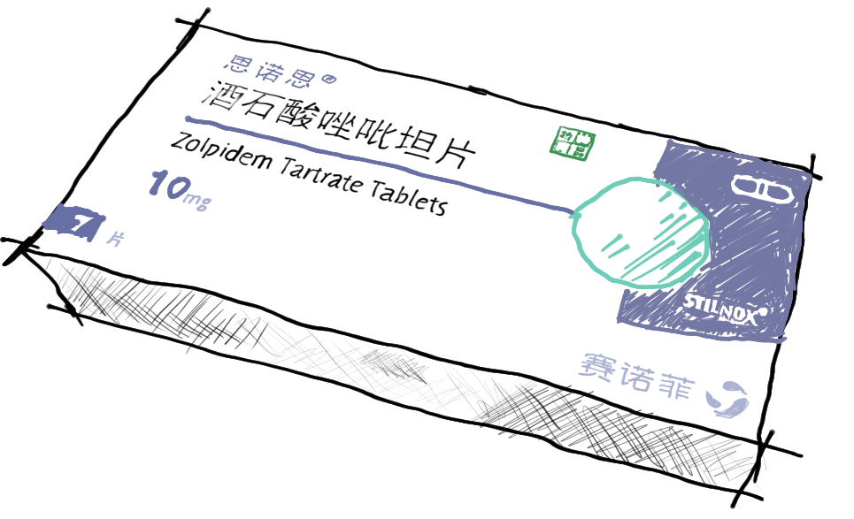

# 小药片冷知识

[返回](README.md)

## 索引

- [酒石酸*唑吡坦*片 `精二`](#酒石酸唑吡坦片-精二)

## 酒石酸*唑吡坦*片 `精二`

- [药品说明 (唑吡坦)](https://zh.wikipedia.org/zh-hans/%E5%94%91%E5%90%A1%E5%9D%A6)
- 记录
  - [`2024.06.18 01:23`](sleep.md#唑吡坦-思诺思-精二)
- **冷知识**
  - 每日用量超过 `10 mg` 可能会出现[幻觉](https://zh.wikipedia.org/wiki/%E5%B9%BB%E8%A7%89), 不过一次吃几 tablet 都没事 (它很安全, 但是肝...)
  - ~~所以咱[第一次](sleep.md#唑吡坦-思诺思-精二)吃 `10 mg` 都睡不着, 是不是应该加到 `70 mg`~~

|酒石酸唑吡坦片 (思诺思)|
|---|
|  |
| [说明书](酒石酸唑吡坦片-stilnox-cn-20240831.pdf) \| 每盒 `1 tablet = 7 片` 规格 `10 mg` |
