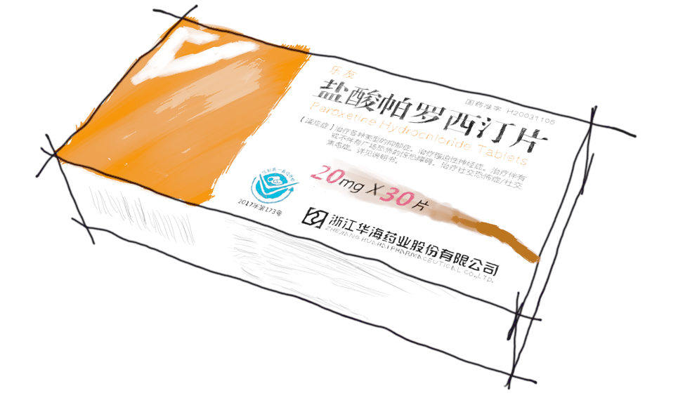
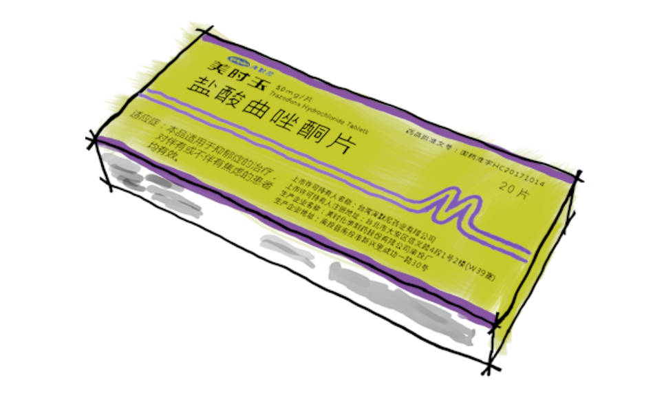

# 药片热知识

[返回](README.md)

## 索引

- [戊酸*雌二醇*片](#戊酸雌二醇片)
- [盐酸*帕罗西汀*片](#盐酸帕罗西汀片)

## 戊酸*雌二醇*片

- [药品说明 (雌二醇)](https://zh.wikipedia.org/wiki/%E9%9B%8C%E4%BA%8C%E9%86%87)
- **热知识**
  - 糖衣是甜的, 虽然它是口服的但是它还能含服
  - 它比诺更硬而且硬很多
  - ~~而且它还是 Debian CD 的包装盒~~

| 戊酸雌二醇片 (补佳乐) |
|---|
|  |
| [说明书](assets/补佳乐.pdf) \| 每盒 `1 tablet = 21 片` 规格 `1 mg` |

## 盐酸*帕罗西汀*片

- [药品说明 (帕罗西汀)](https://zh.wikipedia.org/zh-hans/%E5%B8%95%E7%BD%97%E8%A5%BF%E6%B1%80)
- **热知识**
  - todo

| 盐酸帕罗西汀片 |
|---|
|  |
| [说明书(亲自扫描)](assets/盐酸帕罗西汀片.pdf) \| 每盒 `3 tablet = 30 片` 规格 `20 mg` |

## 盐酸*曲唑酮*片

- [药品说明 (曲唑酮)](https://zh.wikipedia.org/zh-hans/%E6%9B%B2%E5%94%91%E9%85%AE)
- **热知识**
  - todo

| 盐酸曲唑酮片 (美时玉) |
|---|
|  |
| [说明书(亲自扫描)](assets/盐酸曲唑酮片.pdf) \| 每盒 `2 tablet = 20 片` 规格 `50 mg` |
